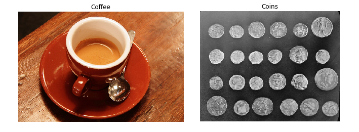

## Is this gray or full of color?

Whats the main difference between the images shown below?



These images have been preloaded as `coffee_image` and `coins_image` from the scikit-image `data` module using:

```python
coffee_image = data.coffee()
coins_image = data.coins()
```

Choose the right answer that best describes the main difference related to color and dimensional structure.

In the console, use the function `shape()` from NumPy, to obtain the image shape (Height, Width, Dimensions) and find out. NumPy is already imported as `np`.


### Possible Answers

- Both have 3 channels for RGB-3 color representation.

- `coffee_image` has a shape of (303, 384), grayscale. And `coins_image` (400, 600, 3), RGB-3.

- `coins_image` has a shape of (303, 384), grayscale. And `coffee_image` (400, 600, 3), RGB-3.

- Both are grayscale, with single color dimension.
