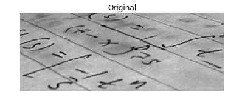

## When the background isn't that obvious

Sometimes, it isn't that obvious to identify the background. If the image background is relatively uniform, then you can use a global threshold value as we practiced before, using `threshold_otsu()`. However, if there's uneven background illumination, adaptive thresholding `threshold_local()` (a.k.a. local thresholding) may produce better results.

In this exercise, you will compare both types of thresholding methods (global and local), to find the optimal way to obtain the binary image we need.

Image loaded as `page_image`.

### Instructions

- Import the otsu threshold function, obtain the optimal global thresh value of the image, and apply global thresholding.

- Import the local threshold function, set block size to 35, obtain the local thresh value, and apply local thresholding.