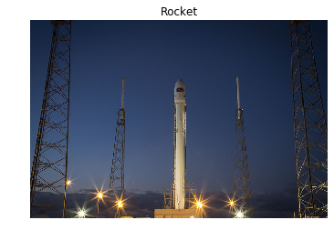

## RGB to grayscale

In this exercise you will load an image from scikit-image module `data` and make it grayscale, then compare both of them in the output.

<!-- We have preloaded a function `show_image(image, title='Image')` that displays the image using Matplotlib. You can check more about its parameters using `?show_image()` or `help(show_image)` in the console. -->

<!-- 
### Instructions

- Import the modules from Scikit image.

- Load the rocket image.

- Convert the RGB-3 rocket image to grayscale.
 -->