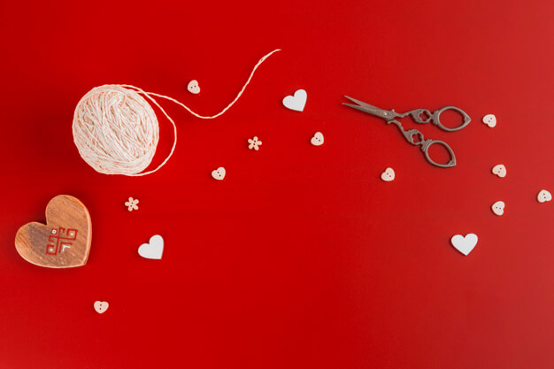

## Apply thresholding

In this exercise, you will decide what type of thresholding is best used to binarize an image of knitting and craft tools. In doing so, you will be able to see the shapes of the objects, from paper hearts to scissors more clearly.

<!-- Image loaded as `tools_image`. -->

What type of thresholding would you use judging by the characteristics of the image? Is the background illumination and intensity even or uneven?
<!-- 
### Instructions

- Import the appropriate thresholding and `rgb2gray()` functions.

- Turn the image to grayscale.

- Obtain the optimal thresh.

- Obtain the binary image by applying thresholding.
 -->