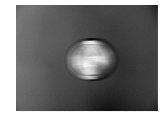

## What's the contrast of this image?

and 

Images are located at `i/3.{1,2}.png`.

The histogram tell us.

Just as we saw previously, you can calculate the contrast by calculating the **range** of the pixel intensities i.e. by subtracting the minimum pixel intensity value from the **histogram** to the maximum one.

You can obtain the maximum pixel intensity of the image by using the `np.max()` method from NumPy and the minimum with `np.min()` **in the console**.

The image has already been loaded as `clock_image`, NumPy as `np` and the `show_image()` function.

### Possible Answers

- The contrast is 255 (high contrast).

- The contrast is 148.

- The contrast is 189.

- The contrast is 49 (low contrast).
