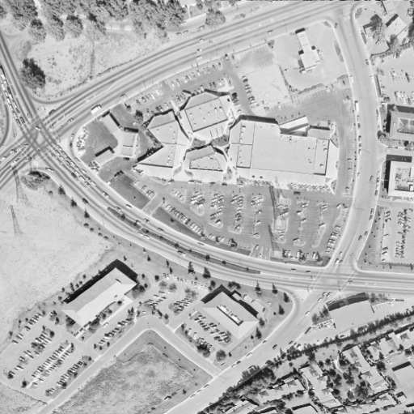

## Aerial image

In this exercise, we will improve the quality of an aerial image of a city. The image has low contrast and therefore we can not distinguish all the elements in it.

Image located at `i/5.png`.

<!-- Image loaded as `image_aerial`. -->

For this we will use the normal or standard technique of Histogram Equalization.
<!-- 
### Instructions

- Import the required module from scikit-image.

- Use the histogram equalization function from the module previously imported.

- Show the resulting image.
 -->