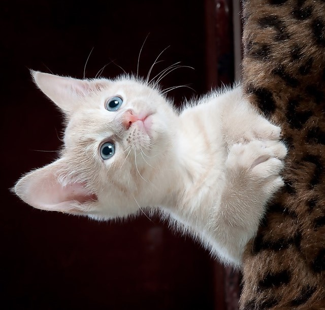

## Aliasing, rotating and rescaling

Let's look at the impact of aliasing on images.

Remember that aliasing is an effect that causes different signals, in this case pixels, to become indistinguishable or distorted.

You'll make this cat image upright by rotating it 90 degrees and then rescaling it two times. Once with the anti aliasing filter applied before rescaling and a second time without it, so you can compare them.

Image preloaded as `image_cat`.

### Instructions

- Import the module and the rotating and rescaling functions.

- .

- .

- .
