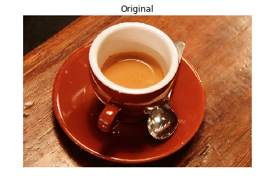

## Let's add some impact and contrast

Have you ever wanted to enhance the contrast of your photos so that they appear more dramatic?

In this exercise, you'll increase the contrast of a cup of coffee. Something you could share with your friends on social media. Don't forget to use **#ImageProcessingDatacamp** as hashtag!

Even though this is not our Sunday morning coffee cup, you can still apply the same methods to any of our photos.

<!-- A function called `show_image()`, that displays an image using Matplotlib, has already been defined. It has the arguments `image` and `title`, with `title` being `'Original'` by default. -->
<!-- 
### Instructions

- Import the module that includes the Contrast Limited Adaptive Histogram Equalization (CLAHE) function.

- Obtain the image you'll work on, with a cup of coffee in it, from the module that holds all the images for testing purposes.

- From the previously imported module, call the function to apply the adaptive equalization method on the original image and set the clip limit to 0.03.
 -->