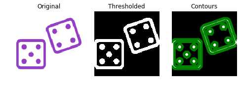

## Count the dots in a dice's image

Now we have found the contours, we can extract information from it.

In the previous exercise, we prepared a purple dices image to find its contours:

Image located at `i/10.png`.

This time we'll determine what number was rolled for the dice, by counting the dots in the image.

<!-- The contours found in the previous exercise are preloaded as `contours`. -->

Create a list with all contour's shapes as `shape_contours`. You can see all the contours shapes by calling `shape_contours` in the console, once you have created it.

Check that most of the contours aren't bigger in size than 50. If you count them, they are the exact number of dots in the image.

<!-- `show_image_contour(image, contours)` is a preloaded function that displays the image with all contours found using Matplotlib. -->

Set `max_dots_shape` to 50.
<!-- 
### Instructions

- Make `shape_contours` be a list with all contour shapes of `contours`.

- Set the shape condition of the contours to be the maximum shape size of the dots `max_dots_shape`.

- Print the dice's number.
 -->