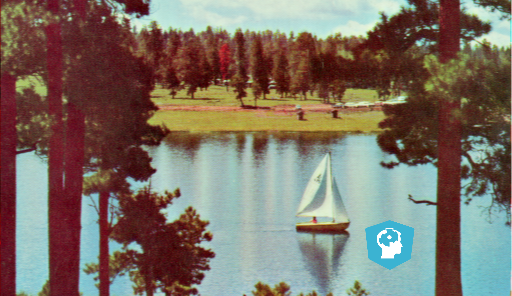

## Removing logos

As we saw in the video, another use of image restoration is removing objects from an scene. In this exercise, we'll remove the Datacamp logo from an image.

Image located at `i/2.png`.

<!-- Image loaded as `image_with_logo`. -->

You will create and set the mask to be able to erase the logo by inpainting this area.

Remember that when you want to remove an object from an image you can either manually delineate that object or run some image analysis algorithm to find it.
<!-- 
### Instructions

- Initialize a mask with the same shape as the image, using `np.zeros()`.

- In the mask, set the region that will be inpainted to 1.

- Apply inpainting to `image_with_logo` using the `mask`.
 -->