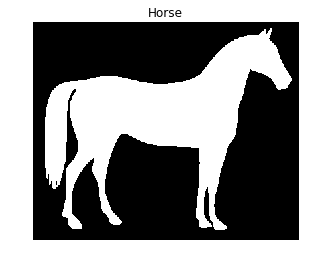

## Contouring shapes

In this exercise we'll find the contour of a horse.

For that we will make use of a **binarized** image provided by scikit-image in its `data` module. Binarized images are easier to process when finding contours with this algorithm. Remember that contour finding only supports 2D image arrays.

Once the contour is detected, we will display it together with the original image. That way we can check if our analysis was correct!

<!-- `show_image_contour(image, contours)` is a preloaded function that displays the image with all contours found using Matplotlib. -->

Image located at `i/8.png`.

Remember you can use the `find_contours()` function from the `measure` module, by passing the thresholded image and a constant value.

Find the contours of the horse image using a constant level value of 0.8.
<!-- 
### Instructions

- Import the data and the module needed for contouring detection.

- Obtain the horse image shown in the context area.
 -->