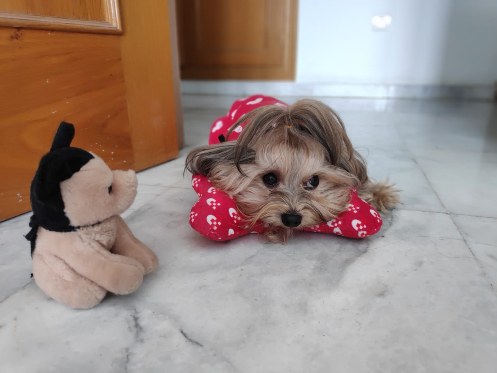

## Reducing noise

We have a noisy image that we want to improve by removing the noise in it.

<!-- Preloaded as `noisy_image`. -->

Use total variation filter denoising to accomplish this.
<!-- 
### Instructions

- Import the `denoise_tv_chambolle` function from its module.

- Apply total variation filter denoising.

- Show the original noisy and the resulting denoised image.
 -->