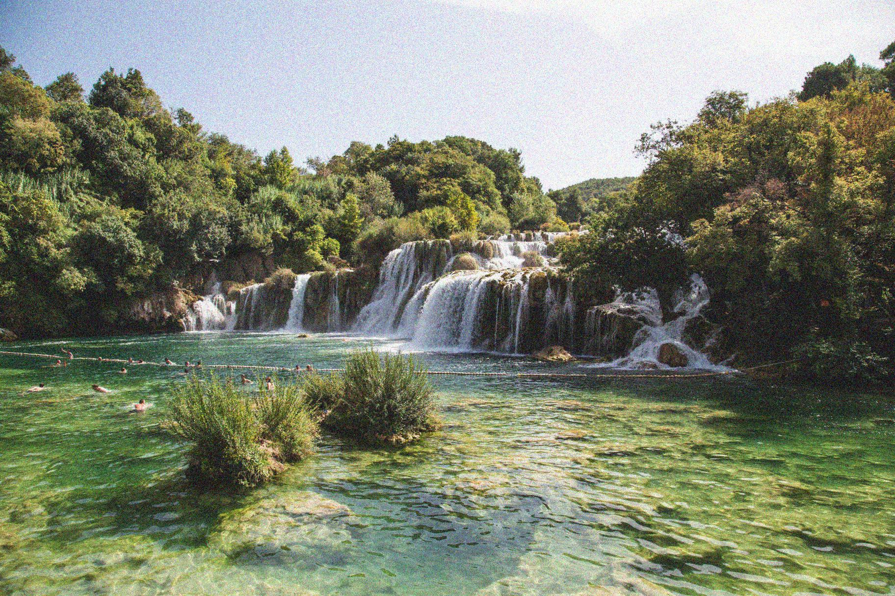

## Reducing noise while preserving edges

In this exercise, you will reduce the noise in this landscape picture.

<!-- Preloaded as `landscape_image`. -->

Since we prefer to preserve the edges in the image, we'll use the bilateral denoising filter.
<!-- 
### Instructions

- Import the denoise_bilateral function from its module.

- Apply bilateral filter denoising.

- Show the original noisy and the resulting denoised image.
 -->