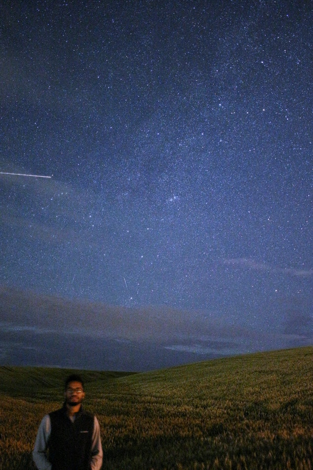

## Is someone there?

In this exercise, you will check whether or not there is a person present in an image taken at night.

<!-- Image preloaded as `night_image`. -->

<!-- The `Cascade` of classifiers class from `feature` module has been already imported. The same is true for the `show_detected_face()` function, that is used to display the face marked in the image and crop so it can be shown separately. -->

Detect the faces in the image, setting the minimum size of the searching window to 10 pixels and 200 pixels for the maximum.
<!-- 
### Instructions

- Load the trained file from the `data` module.

- Initialize the detector cascade with the trained file.
 -->