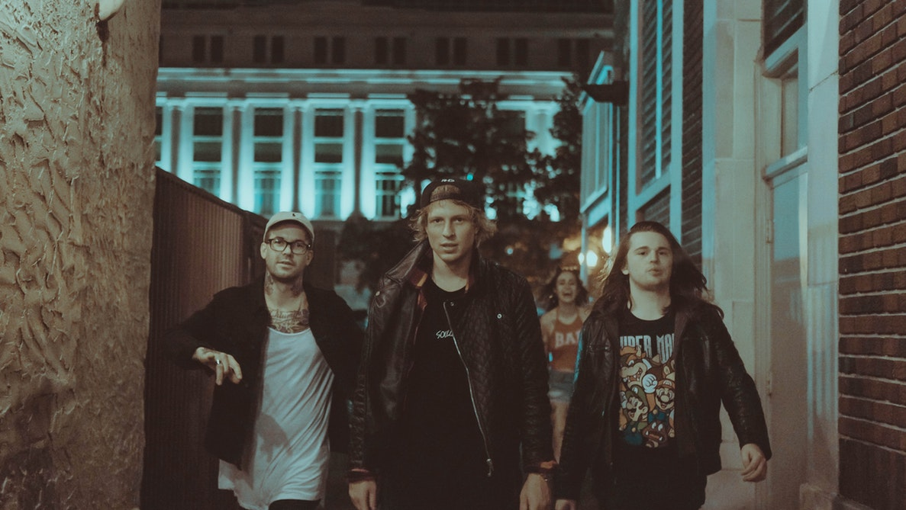

## Privacy protection

Let's look at a real-world application of what you have learned in the course.

In this exercise, you will detect **human** faces in the image and for the sake of privacy, you will anonymize data by blurring people's faces in the image automatically.

<!-- Image preloaded as `group_image`. -->

You can use the gaussian filter for the blurriness.

<!-- The face detector is ready to use as `detector` and all packages needed have been imported. -->

### Instructions

- Detect the faces in the image using the `detector`, set the minimum size of the searching window to 10 by 10 pixels.

- Go through each detected face with a for loop.

- Apply a gaussian filter to detect and blur faces, using a sigma of 8.
